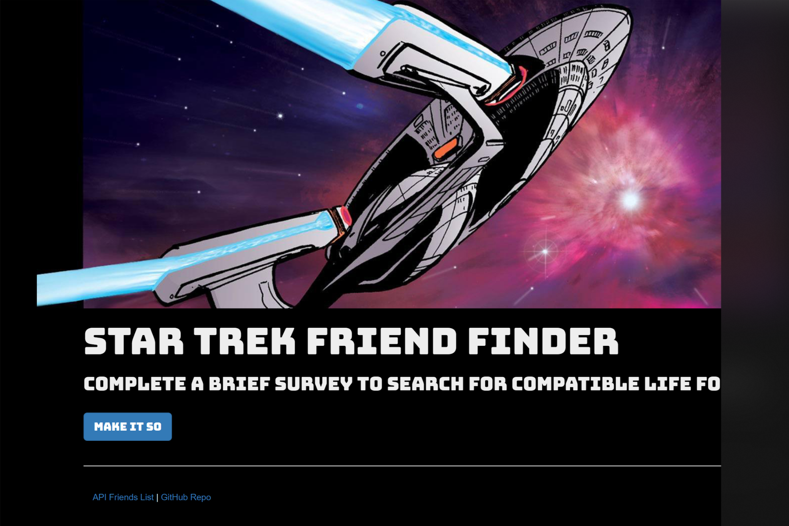
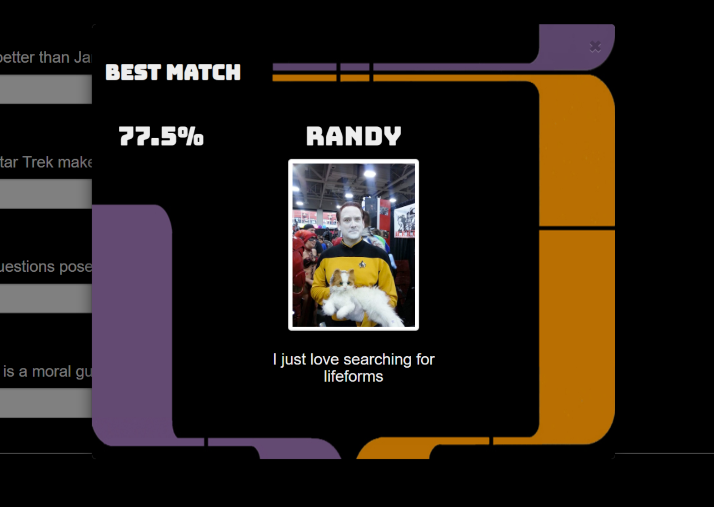

# FriendFinder

[View on Heroku](https://evening-spire-37402.herokuapp.com/)

## Overview

'FriendFinder' is a web application that matches users based on survey responses regarding their interest in Star Trek. It was built as an exercise in modularization and routing with express. 

FriendFinder uses static mock 'data' to compare against new user responses. For each 'friend' in the array the absolute difference of each response is calculated. The lowest score indicates the user whose answers were most similar. 

The data from the closest match is displayed as a modal the page revealing your new found friend.

## Built With:
* node.js
* express.js